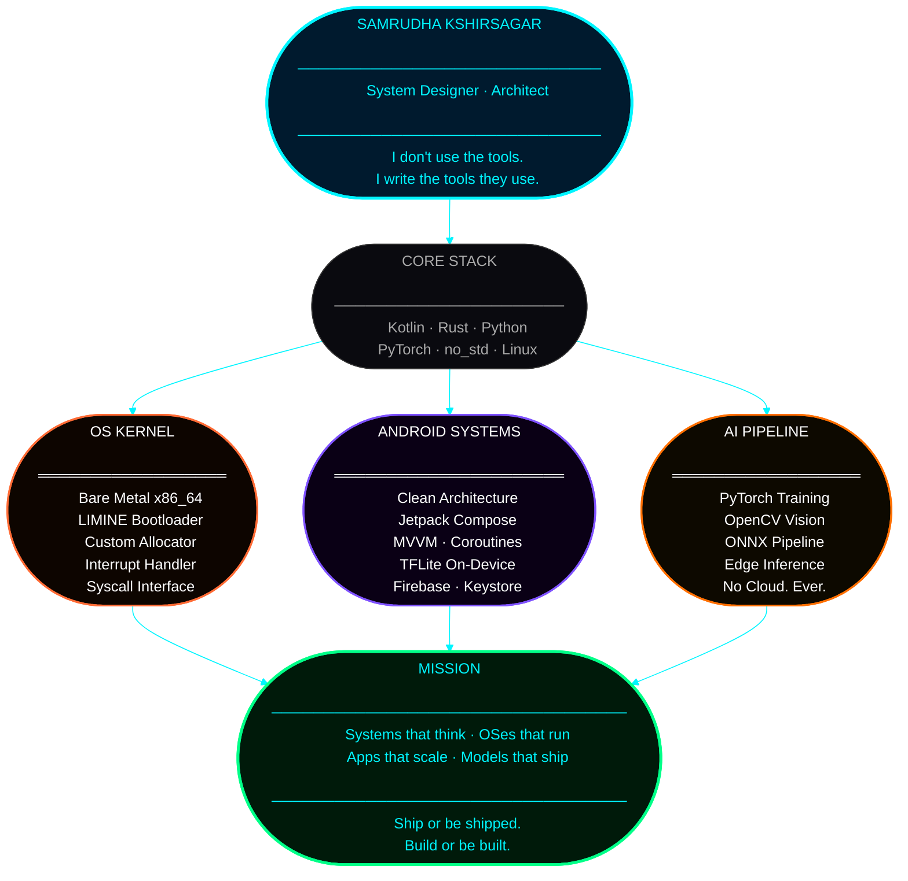

<!-- ████████████████████████████████████████████████████████████████ -->
<!--                    SAMRUDHA KSHIRSAGAR                           -->
<!--              "I am System Designer" — S. K, 2005                 -->
<!-- ████████████████████████████████████████████████████████████████ -->

<div align="center">


</div>

<div align="center">



</div>

<br/>

<div align="center">
  
</div>

---

## ⚡ THE SAM BRIEF

> I don't just build apps.  
> I architect execution engines, design operating systems from scratch, and push hardware to its absolute limits —  
> all while writing clean, production-grade code that ships.
>
> **If Tony Stark wrote Android apps and built kernels in Rust, this would be his GitHub.**

---

## 🔬 ACTIVE RESEARCH PROTOCOLS

<table>
<tr>
<td width="50%" valign="top">

### 🦀 RUST-BASED OPERATING SYSTEM
*From zero to kernel. Bare metal.*

Building a **production-quality OS** from scratch:

- 🧠 Physical & Virtual **Memory Management**
- ⚡ **Interrupt / Exception Handling**
- 💾 **Filesystem Primitives**
- 🐚 **Minimal Shell** (custom syscall interface)
- 🖥️ Targeted for **QEMU** and **bare metal** execution

> *"The suit wasn't built in a day."*

</td>
<td width="50%" valign="top">

### 🏗️ SYSTEM-LEVEL ARCHITECTURE
*Where the real engineers live.*

Deep-diving low-level design:

- 🔧 **Bootloaders** (LIMINE) — Stage 0 to kernel handoff
- 🔌 **Driver Interfaces** — Hardware communication layers
- 🧩 **Hardware Abstraction Layer (HAL)** — Future-proof, modular
- 🎯 Focus: **modularity**, **scalability**, long-term OS evolution

> *"Simplicity is the ultimate sophistication."*

</td>
</tr>
<tr>
<td width="50%" valign="top">

### 🚀 PERFORMANCE-CRITICAL ENGINEERING
*Efficiency isn't optional. It's the spec.*

Engineering for deterministic, blazing-fast execution:

- ⚙️ Optimizing **low-level execution paths**
- 🔻 Reducing **syscall overhead** to near zero
- 📐 Enforcing **predictable behavior** under resource constraints
- 🧵 Memory-safe, race-free systems by design

</td>
<td width="50%" valign="top">

### 📱 ANDROID SYSTEMS ENGINEERING
*Not just mobile. Systems on mobile.*

Production-grade Android architecture:

- 🏛️ **Clean Architecture** + MVVM at scale
- 🔗 Deep Jetpack: Compose, Room, WorkManager, Navigation
- 🔥 Firebase, ML Kit, TFLite inference on-device
- 🛡️ Security-first: Keystore, SafetyNet, custom sandboxing

</td>
</tr>
</table>

---

## 🧰 TECHNOLOGY ARSENAL

<div align="center">

### ∎ CORE STACK

<p>
  
</p>

### ∎ AI / ML LAYER

<p>
  
</p>

### ∎ INFRASTRUCTURE & TOOLS

<p>
  
</p>

</div>

---

## 📊 COMBAT STATISTICS

<div align="center">

<a href="https://github.com/samrudha01codespace">
  
  
</a>

</div>

<div align="center">
  
</div>

<br/>

---

## 🛰️ FLAGSHIP MISSIONS

<table width="100%">
<tr>

<td width="50%" valign="top">

### 🦀 [`AIsOS Kernel`](https://github.com/samrudha01codespace) &nbsp; 

> *A Rust-native OS built from zero. No shortcuts. No POSIX hand-holding.*

```
ARCH     →  x86_64 bare metal + QEMU
BOOT     →  LIMINE bootloader
MEMORY   →  Custom physical + virtual allocator
SHELL    →  Minimal, syscall-driven
LANGUAGE →  100% Rust (no_std)
```

Memory-safe kernel code by default. No GC, no garbage, no mercy.
Built to understand computing at the instruction level.

[](https://github.com/samrudha01codespace)
[](https://github.com/samrudha01codespace)
[](https://github.com/samrudha01codespace)

</td>

<td width="50%" valign="top">

### 📱 [`Android Architecture Lab`](https://github.com/samrudha01codespace) &nbsp; 

> *Production-grade Android apps engineered like system software — not tutorials.*

```
ARCH     →  Clean Architecture + MVVM
UI       →  Jetpack Compose (declarative, reactive)
AI LAYER →  TFLite on-device inference
BACKEND  →  Firebase (Firestore, Auth, FCM)
PERF     →  Custom coroutine + Flow pipelines
```

On-device ML inference, zero-lag UI, offline-first data strategy.
Architected to scale — not just to ship.

[](https://github.com/samrudha01codespace)
[](https://github.com/samrudha01codespace)
[](https://github.com/samrudha01codespace)

</td>

</tr>
<tr>
<td colspan="2" valign="top">

### 🤖 [`AI Vision Pipeline`](https://github.com/samrudha01codespace) &nbsp; 

> *Real-time computer vision inference pipeline. PyTorch → ONNX → Edge. No cloud. No compromise.*

```
FRAMEWORK →  PyTorch (custom training loops)       DEPLOY  →  ONNX export → TFLite → Android edge
VISION    →  OpenCV preprocessing + augmentation   FOCUS   →  Low-latency, memory-efficient inference
```

Full pipeline from model training to on-device deployment. Inference at the edge, always. The model ships with the app.

[](https://github.com/samrudha01codespace)
[](https://github.com/samrudha01codespace)
[](https://github.com/samrudha01codespace)
[](https://github.com/samrudha01codespace)

</td>
</tr>
</table>

---

<div align="center">
  
  
  
  <br/><br/>
  
</div>

---

## 🌐 OPEN COMMUNICATION CHANNELS

<div align="center">

[](https://linkedin.com/in/samrudha-kshirsagar-5aa89128a)
[](https://twitter.com/@samrudha_appdev)
[](mailto:samrudhakshirsagar@gmail.com)

</div>

---

## 📡 PROFILE TELEMETRY

<div align="center">


</div>

---

<div align="center">

```
╔══════════════════════════════════════════════════════════════╗
║                                                              ║
║        MISSION: Build systems that outlast the hype.         ║
║        METHOD:  Precision engineering. Zero shortcuts.       ║
║        STATUS:  Scaling skill → shipping systems → impact    ║
║                                                              ║
║        "The obstacle is the way. The code is the proof."     ║
║                                                              ║
╚══════════════════════════════════════════════════════════════╝
```


</div>

<!-- ████████████████████████████████████████████████████████████████ -->
<!--         END OF HUD — SYSTEM NOMINAL — ALL ENGINES GREEN         -->
<!-- ████████████████████████████████████████████████████████████████ -->
