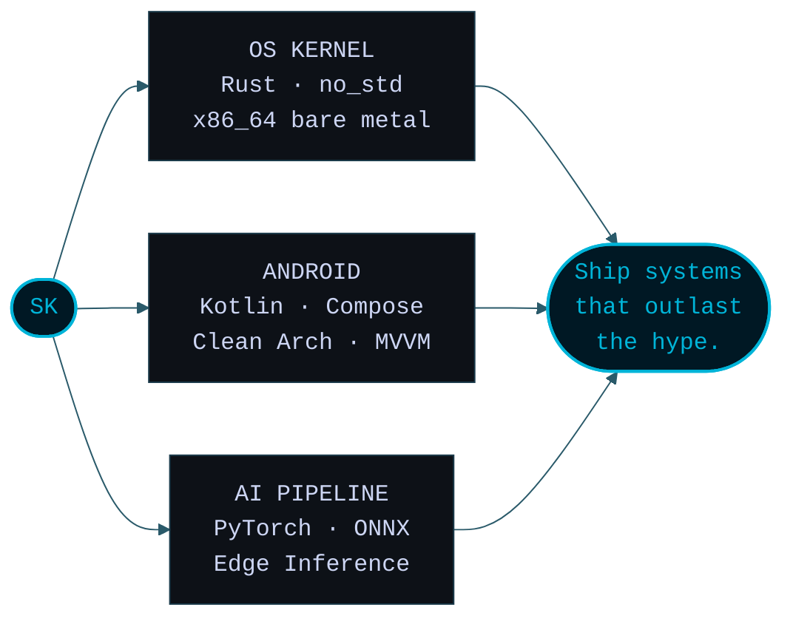

<!-- SAMRUDHA KSHIRSAGAR — GITHUB README -->

<div align="center">

</div>

<br/>

<div align="center">

<picture>
  
</picture>

<br/><br/>

<picture>
  
</picture>

<br/>

<picture>
  
</picture>

</div>

<br/>

<div align="center">

</div>

<br/>

<div align="center">

> **I don't use the tools.**  
> **I write the tools they use.**

</div>

<br/>

---

<br/>

## `// CORE DIRECTIVE`

<br/>

I architect execution engines. I build operating systems from bare metal. I push inference to the edge — no cloud, no compromise.

The standard isn't *working*. The standard is **correct, fast, and maintainable** at every layer of the stack — from bootloader to UI thread.

<br/>

<table>
<tr>
<td align="center" width="33%">

**`DEPTH`**<br/>
<sub>Kernel internals, memory models,<br/>interrupt architecture, syscall design</sub>

</td>
<td align="center" width="33%">

**`PRECISION`**<br/>
<sub>Deterministic execution, zero-overhead abstractions,<br/>memory safety without GC</sub>

</td>
<td align="center" width="33%">

**`SCALE`**<br/>
<sub>Clean architecture, reactive pipelines,<br/>on-device ML, production Android systems</sub>

</td>
</tr>
</table>

<br/>


```mermaid
%%{init: {'theme': 'base', 'themeVariables': {'primaryColor': '#0D1117', 'primaryTextColor': '#00B4D8', 'primaryBorderColor': '#1a3a4a', 'lineColor': '#2a5a6a', 'secondaryColor': '#0a1520', 'tertiaryColor': '#0a1520', 'nodeTextColor': '#cdd6f4', 'edgeLabelBackground': '#0D1117', 'clusterBkg': '#0a1520', 'titleColor': '#00B4D8', 'fontFamily': 'monospace'}}}%%

graph LR
    SK(["SK"])

    SK --> OS["OS KERNEL\nRust · no_std\nx86_64 bare metal"]
    SK --> AND["ANDROID\nKotlin · Compose\nClean Arch · MVVM"]
    SK --> AI["AI PIPELINE\nPyTorch · ONNX\nEdge Inference"]

    OS --> OUT(["Ship systems\nthat outlast\nthe hype."])
    AND --> OUT
    AI --> OUT

    style SK fill:#001824,color:#00B4D8,stroke:#00B4D8,stroke-width:2px
    style OS fill:#0D1117,color:#cdd6f4,stroke:#1a3a4a,stroke-width:1px
    style AND fill:#0D1117,color:#cdd6f4,stroke:#1a3a4a,stroke-width:1px
    style AI fill:#0D1117,color:#cdd6f4,stroke:#1a3a4a,stroke-width:1px
    style OUT fill:#001824,color:#00B4D8,stroke:#00B4D8,stroke-width:2px
```

<br/>

---

<br/>

## `// ACTIVE RESEARCH PROTOCOLS`

<br/>

<table>
<tr>
<td width="50%" valign="top">

### 🦀 &nbsp; Rust-Native OS Kernel

*From zero. Bare metal. No POSIX hand-holding.*

```
TARGET   →  x86_64 · QEMU · bare metal
BOOT     →  LIMINE bootloader
MEMORY   →  Custom physical + virtual allocator
SCHED    →  Minimal syscall-driven shell
LANG     →  100% Rust · no_std
```

Memory-safe kernel code by default.  
No GC. No garbage. No mercy.  
Built to understand computing at the instruction level.

</td>
<td width="50%" valign="top">

### 📱 &nbsp; Android Systems Engineering

*Not just mobile. Systems engineering on mobile.*

```
ARCH     →  Clean Architecture + MVVM at scale
UI       →  Jetpack Compose · declarative + reactive
AI       →  TFLite on-device inference
BACKEND  →  Firebase · Firestore · Auth · FCM
PERF     →  Custom coroutine + Flow pipelines
```

Offline-first. Security-first.  
Keystore, SafetyNet, custom sandboxing.  
Architected to scale — not just to ship.

</td>
</tr>
<tr>
<td width="50%" valign="top">

### 🤖 &nbsp; AI Vision Pipeline

*PyTorch → ONNX → Edge. The model ships with the app.*

```
TRAIN    →  PyTorch · custom training loops
VISION   →  OpenCV preprocessing + augmentation
DEPLOY   →  ONNX → TFLite → Android edge
FOCUS    →  Low-latency · memory-efficient inference
```

Full pipeline: training to on-device deployment.  
Inference at the edge, always.  
No cloud dependency. Ever.

</td>
<td width="50%" valign="top">

### ⚙️ &nbsp; Performance-Critical Engineering

*Efficiency isn't optional. It's the spec.*

```
EXEC     →  Optimized low-level execution paths
SYSCALL  →  Near-zero overhead interfaces
MEMORY   →  Race-free · memory-safe by design
BEHAVIOR →  Predictable under resource constraints
```

Deterministic systems.  
Correctness before cleverness.  
The hardware doesn't forgive guesses.

</td>
</tr>
</table>

<br/>

---

<br/>

## `// TECHNOLOGY ARSENAL`

<br/>

<div align="center">

**CORE LANGUAGES**

<p>

</p>

<br/>

**AI · ML · VISION**

<p>

</p>

<br/>

**PLATFORMS · TOOLS**

<p>

</p>

</div>

<br/>

---

<br/>

## `// SYSTEM TELEMETRY`

<br/>

<div align="center">


&nbsp;


</div>

<br/>

<div align="center">

</div>

<br/>

<div align="center">

</div>

<br/>

---

<br/>

## `// FLAGSHIP MISSIONS`

<br/>

<table width="100%">
<tr>
<td width="50%" valign="top">

### [`AIsOS Kernel`](https://github.com/samrudha01codespace) &nbsp; `IN_PROGRESS`

A Rust-native kernel built from zero. No abstraction layers, no training wheels.

**Milestones:**
- Physical & virtual memory management
- Interrupt & exception handling
- Filesystem primitives
- Syscall-driven minimal shell

[](https://github.com/samrudha01codespace)
[](https://github.com/samrudha01codespace)
[](https://github.com/samrudha01codespace)

</td>
<td width="50%" valign="top">

### [`Android Architecture Lab`](https://github.com/samrudha01codespace) &nbsp; `LIVE`

Production Android apps engineered like system software — not tutorials.

**Stack:**
- Clean Architecture + MVVM
- Jetpack Compose — declarative, reactive
- TFLite on-device inference
- Custom coroutine + Flow pipelines

[](https://github.com/samrudha01codespace)
[](https://github.com/samrudha01codespace)
[](https://github.com/samrudha01codespace)

</td>
</tr>
<tr>
<td colspan="2" valign="top">

### [`AI Vision Pipeline`](https://github.com/samrudha01codespace) &nbsp; `RESEARCH`

Real-time computer vision inference pipeline — from training loop to edge deployment.  
PyTorch → ONNX → TFLite → Android. The model ships with the app.

[](https://github.com/samrudha01codespace)
[](https://github.com/samrudha01codespace)
[](https://github.com/samrudha01codespace)
[](https://github.com/samrudha01codespace)

</td>
</tr>
</table>

<br/>

---

<br/>

## `// OPEN CHANNELS`

<br/>

<div align="center">

[](https://linkedin.com/in/samrudha-kshirsagar-5aa89128a)
&nbsp;
[](https://twitter.com/@samrudha_appdev)
&nbsp;
[](mailto:samrudhakshirsagar@gmail.com)

</div>

<br/>

<div align="center">

</div>

<br/>

---

<br/>

<div align="center">

<picture>
  
</picture>

<br/><br/>


</div>
